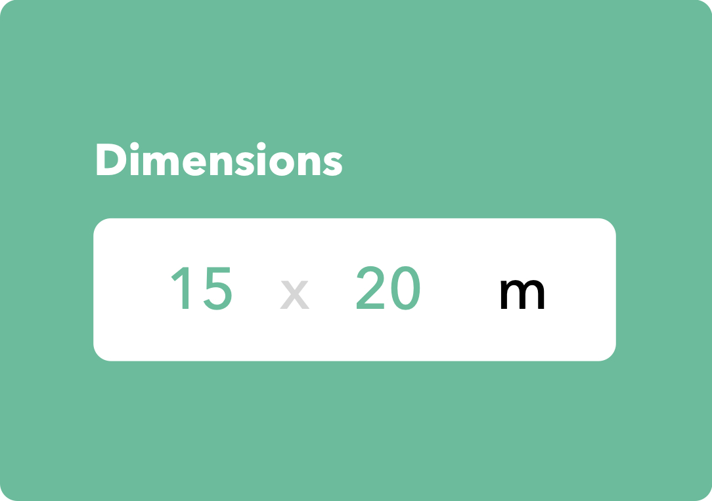

# DimensionsPickerView

[](https://travis-ci.org/hussc/DimensionsPickerView)
[](https://cocoapods.org/pods/DimensionsPickerView)
[](https://cocoapods.org/pods/DimensionsPickerView)
[](https://cocoapods.org/pods/DimensionsPickerView)



## Example

To run the example project, clone the repo, and run `pod install` from the Example directory first.

## Requirements

## Installation

DimensionsPickerView is available through [CocoaPods](https://cocoapods.org). To install
it, simply add the following line to your Podfile:

```ruby
pod 'DimensionsPickerView'
```

## Author

hussc, hus.sc@aol.com

## License

DimensionsPickerView is available under the MIT license. See the LICENSE file for more info.
